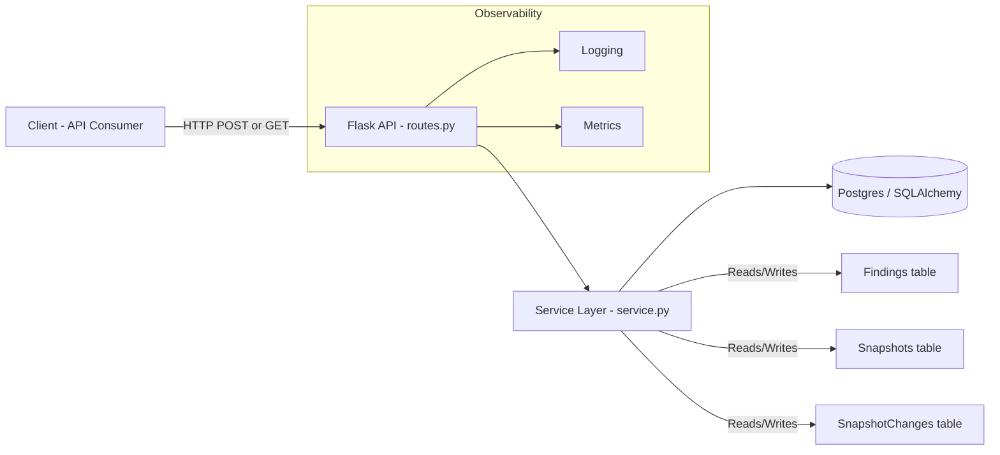
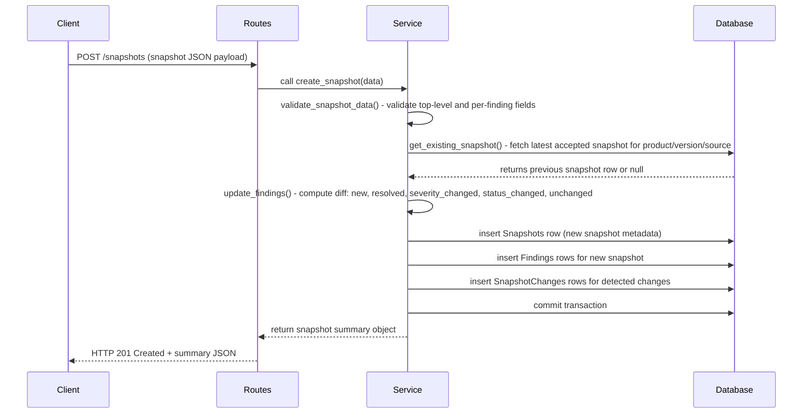

# Architecture and Diagrams

## Overview
This document shows the high-level architecture and important flows for the Vulnerability Snapshot Monitor.

### Overall Architecture



Explanation:
- Client: external system or user that submits snapshots or queries change history.
- Flask API (`routes.py`): thin HTTP layer that handles request parsing, response formatting and maps domain exceptions (validation/conflict/not found) to HTTP status codes.
- Service layer (`service.py`): core business logic — validation, diff computation, persistence helpers, and query functions.
- Database: Postgres via SQLAlchemy stores `Snapshots`, `Findings`, and `SnapshotChanges` tables. Observability components capture logs and metrics.

### Component Design (simplified)

```mermaid
flowchart TB
  Routes[Routes (routes.py)] --> ServiceComp[Service (service.py)]
  ServiceComp --> Models[Models (model.py) - Snapshots/Findings/Changes]
  Models --> DBComp[SQLAlchemy / Postgres]
  Routes -->|error mapping| Errors[Error mapping (HTTP codes)]
  ServiceComp -->|validation & diff| Validators[Validators & Helpers]
```

Explanation:
- `routes.py` keeps request/response concerns and delegates domain work to `service.py`.
- `service.py` should contain deterministic algorithms for diffing snapshots and all DB interactions; it raises domain exceptions that routes map to HTTP responses.
- `model.py` contains SQLAlchemy models and DB constraints (unique keys, check constraints).

### Sequence: POST /snapshots (ingest)



Step-by-step sequence explanation:
1. Client submits a well-formed snapshot JSON to `POST /snapshots`.
2. `routes.py` forwards the payload to `create_snapshot()` in `service.py` (a thin wrapper ensures HTTP-layer concerns remain separate).
3. `service.py` runs `validate_snapshot_data()` to check required top-level fields (`product_name`, `product_version`, `source`, `snapshot_time`, `findings`) and per-finding fields (`vulnerability_id`, `component_name`, `component_version`, `severity`, `affected_status`, `cvss_score`). Validation returns deterministic 400 errors for invalid inputs.
4. `service.py` queries the DB for the previous accepted snapshot for the same `product_name`, `product_version`, and `source` (current assumption in this repo). If none exists, the current snapshot is treated as the first snapshot.
5. The diff computation (`update_findings` / `get_resolved_findings_count`) compares matching-key tuples (`vulnerability_id`, `component_name`, `component_version`) to determine `new`, `resolved`, `severity_changed`, and `status_changed`. If both severity and affected_status change for the same finding, two change rows are created.
6. The service inserts the new `Snapshots` row, associated `Findings` rows, and `SnapshotChanges` rows within a DB transaction. After successful writes, the transaction is committed.
7. The service returns a structured summary (snapshot_id, product/version/source, snapshot_time, previous_snapshot_id, and summary counts). `routes.py` formats this into an HTTP 201 response.

Notes:
- The service currently treats `source` as part of snapshot identity to keep data from different scanners or sources isolated; change this behavior if you want cross-source ordering.
- Keep business logic deterministic and covered by unit/integration tests. The next step is to add integration tests that post snapshots and validate resulting DB state and change rows.
